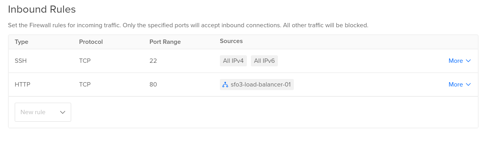
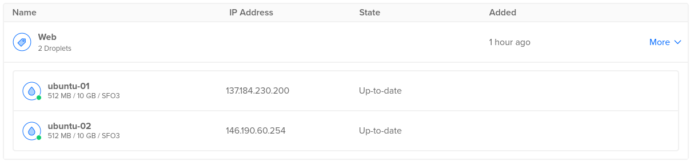
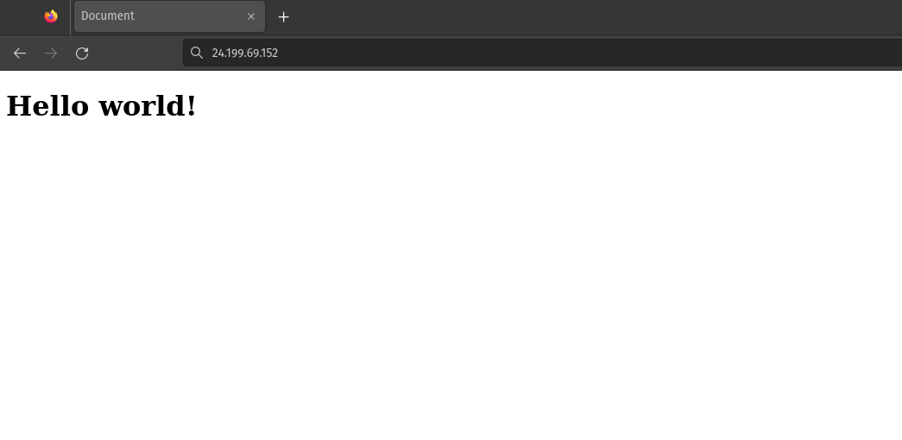

# 2420 Assignment 2

24.199.69.152

## Setting up Digital Ocean
1. Create a VPC in the datacenter your Droplets exist in.
2. Create a load balancer in the datacenter of your VPC.
3. Add your droplets to your load balancer.
3. Create a firewall allowing SSH, and HTTP on port 80 for your load balancer.

4. Add your 2 droplets to the firewall.

## Install Caddy
1. Download caddy `tar xvf https://github.com/caddyserver/caddy/releases/download/v2.6.2/caddy_2.6.2_linux_amd64.tar.gz`.
2. Change caddys owner to root `sudo chown root: caddy`.
3. Move caddy to bin directory `cp caddy /usr/bin`.
4. Copy `caddy.service` to `/etc/systemd/system`.
5. Reload services using `sudo systemctl daemon-reload`.
6. Enable Caddy `sudo systemctl enable caddy.service`.

## Setup Caddy
1. Copy `Caddyfile` to `/etc/caddy/`
2. Restart caddy `sudo systemctl restart caddy.service`.

## Setup node server
1. Install node using volta under root user.
2. Move `src/index.js` and `src/package.json` to `/opt/node`.
3. Install node dependecies in that directory.
4. Add `hello_web.service` to `/etc/systemd/system`.
5. Reload services using `sudo systemctl daemon-reload`.
6. Enable hello_web `sudo systemctl enable hello_web.service`.

## End
You should now have load balanced servers!

